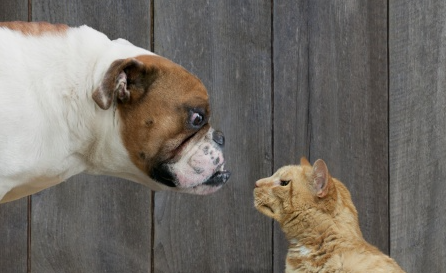
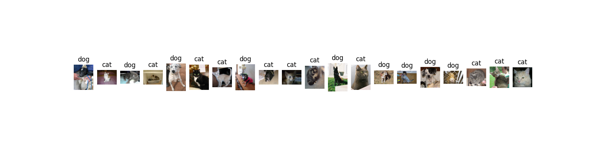

# Cats-vs-Dogs CNN Classifier



Welcome to the Cats-vs-Dogs CNN Classifier project! This repository contains the code and resources for training a Convolutional Neural Network (CNN) to classify images of cats and dogs. The Cat vs Dog Image Classification model demonstrates the successful implementation of a Convolutional Neural Network for image classification tasks. By accurately distinguishing between images of cats and dogs, this project showcases the potential of deep learning algorithms in solving real-world problems involving image analysis. Through this project, we aim to inspire further exploration of CNNs and their applications in various domains,

## Table of Contents

- [Overview](#overview)
- [Dataset](#dataset)
- [Requirements](#requirements)
- [Installation](#installation)
- [Usage](#usage)
- [Training the Model](#training-the-model)
- [Evaluation](#evaluation)
- [Inference](#inference)
- [Results](#results)
- [Contributing](#contributing)
- [License](#license)
- [Acknowledgements](#acknowledgements)

## Overview

The Cats-vs-Dogs CNN Classifier is a deep learning model built using TensorFlow and Keras. The primary objective of this project is to classify images into two categories: cats and dogs. The model is trained on a large dataset of labeled images (25000 images of Cats and Dogs) and is capable of achieving high accuracy through the use of convolutional layers, pooling layers, and fully connected layers.

## Dataset

The dataset used for this project is the [Kaggle Dogs vs. Cats dataset](https://www.kaggle.com/c/dogs-vs-cats). It consists of 25,000 labeled images of cats and dogs. The dataset is divided into training and validation sets to evaluate the performance of the model.

## Requirements

To run this project, you will need the following dependencies:

- Python 3.7 or higher
- TensorFlow 2.x
- Keras
- NumPy
- Matplotlib
- scikit-learn
- Jupyter Notebook (optional, for interactive experimentation)

## Installation

1. Clone this repository to your local machine:

   ```bash
   git clone https://github.com/Tanuj-joshi/Dogs-vs-Cats-Classifier.git 
   cd Cats-vs-Dogs
   ```

2. Create a virtual environment and activate it::

   ```bash
   python -m venv venv
   source venv/bin/activate  # On Windows, use `venv\Scripts\activate`
   ```

3. Install the required dependencies:

   ```bash
   pip install -r requirements.txt
   ```
4. Download the dataset from Kaggle and place it in the data/ directory.

## Usage

### Training the Model

1. Ensure that the dataset is properly placed in the data/ directory.

2. Run the training script:

   ```bash
   python train.py --image_dir Dataset/ --batch_size 32 --epoch 100 --patience 3 --model_path model/
   ```
   This script will train the CNN model on the training dataset and save the trained model to the models/ directory.

3. Above script will also save tensorboard log files in logs/ directory which can be visualized using:

   ```bash
   tensorboard --logdir=logs/
   ```

### Evaluation

 To evaluate the performance of the trained model on the test set, run:

   ```bash
   python evaluate.py --image_dir Dataset/test/ --batch_size 32 --model_path model/
   ```
This script will load the trained model and output the accuracy and loss on the test set.
It also gives Precision, Recall, F1_score and Confusion Matrix.


### Inference

To classify new images, use the inference script:

   ```bash
   python predict.py --image_dir dogs-vs-cats/test2/ --batch_size 32 --model_path model/
   ```
This script will load the trained model and predict whether the image is of a cat or a dog. 
It will also display few sample images with predicted label.

## Results

The model achieves an accuracy of approximately 95.24% on the Test set (315 images containing cats and dogs). Below are some example predictions made by the model:

## Contributing

Contributions are welcome! If you have any ideas for improvements or new features, feel free to fork the repository and submit a pull request.

## License

This project is licensed under the MIT License. See the [LICENSE](LICENSE) file for more details.

## Acknowledgements

- The dataset used in this project is from Kaggle.
- Special thanks to the TensorFlow and Keras teams for their excellent deep learning frameworks.


